# 测试基础设施

## 自动化构件维护

### 自动化构件管理
&#8195;&#8195;&#8194;进入ATF界面后，点击“系统管理”目录，可看到 “自动化构件管理”选项卡。
&#8195;&#8195;&#8194;自动化构件维护的功能是创建、维护自动化测试过程中被测系统所需要的控件类型，方法及其他属性，提前设置好这些属性，可在测试中根据这些设置自动地进行测试，无需人工操作。自动化构件管理模块被“自动化构件维护”利用，可创建多个抽象框架，该框架下可创建控件和方法，当某个具体测试系统继承抽象框架时，测试系统无需创建控件和方法，自动继承抽象框架的控件和方法。如果不需要继承的按钮和方法，也可删除，添加专属自己的按钮和方法。这样的模式好处是抽象框架可被多个被测系统复用，节省了时间。
&#8195;&#8195;&#8194;首先需要点击“自动化构件管理”选项卡进入该模块界面（图1）。最左界面为“开发构架”，即抽象框架的汇总，可进行添加和修改多个树形结构的目录。其中添加的抽象框架可继承自其它框架，即父类的框架类型和方法同时被创建的子类继承（图2）。
<div align='center'>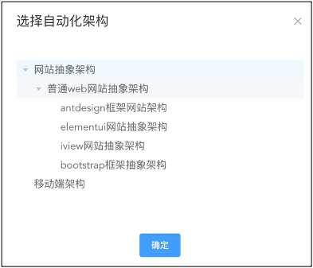</div>
<div align='center'>图1 自动化构件管理-开发构架</div>
<div align='center'>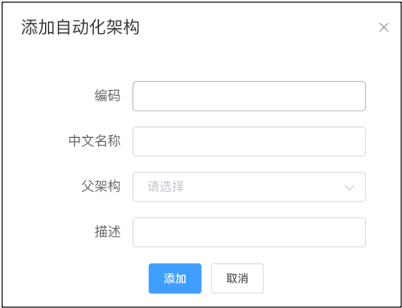</div>
<div align='center'>图2 添加抽象框架</div>
&#8195;&#8195;&#8194;点击抽象框架进入中间的界面（图3），可进行该框架的控件类型和方法的创建。若该框架为父类，则控件类型的继承标志为“自身控件”；若为子类，则子类的控件和父类同名且标志为“继承自父类”；若不同名则为“自身控件”。有控件则还需要设置该控件对应的方法（图4），如输入框对应的方法为“set”,按钮对应的方法为“click”。方法同控件类型，都可继承自父类。“添加方法”界面中可对方法进行创建，设置方法名称，对方法进行描述说明，设置是否有参数，等待时间、超时时间和该方法的执行代码。方法创建后，可进行控件和方法的绑定。
<div align='center'>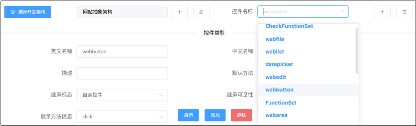</div>
<div align='center'>图3 控件类型</div>
<div align='center'>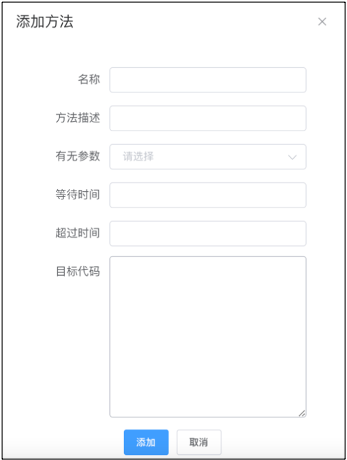</div>
<div align='center'>图4 添加方法</div>
&#8195;&#8195;&#8194;点击控件类型可进入控件类型的详细属性界面（图5），可为该控件补充或修改、查看相应的属性。当控件类型继承自父类，则控件类型不可修改，只能到父类对应的控件类型进行修改。若控件为自身控件，则可修改。“默认方法”下拉框可选择创建好的方法，指定该方法作为元素关联该控件时的初始方法。“继承标志”下拉框有三个可选项：自定义、禁用、重定义。继承可见性有两个选项：公共、私有。若选择私有，则其子类不可继承该控件。

&#8195;&#8195;&#8194;其中“运行时参数”“支持识别属性”“自识别属性”“辅助识别属性”，四个参数的作用分别是，第一个参数是自动化测试运行时所需要的参数，后三个参数是使执行机在一个页面里定位某个控件时所需要的参数。
<div align='center'>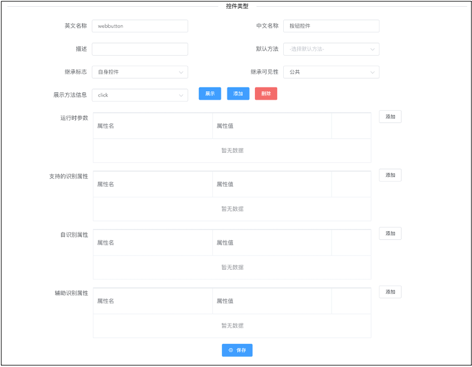</div>
<div align='center'>图5 控件类型属性</div>

### 自动化构件维护
&#8195;&#8195;&#8194;在自动化构件管理中创建完控件和方法，那就可以在具体被测系统中使用这些控件和方法。
&#8195;&#8195;&#8194;回到首页，点击“被测基础设施”，点击“创建”，创建测试系统，填写“测试系统编号”、“测试系统名称”、“开发框架”、“描述”（图6），其中开发框架可选择来自“自动化管理模块”所创建的抽象框架，此时该被测试系统对应的控件和方法可继承被选开发框架的控件和方法。
<div align='center'>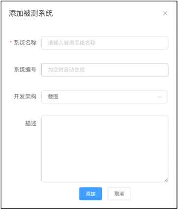</div>
<div align='center'>图6 添加测试系统</div>

&#8195;&#8195;&#8194;在被测基础设施页面中选中被测系统，点击“展开高级功能”，点击“自动化构件维护”选项卡进入该测试系统的自动化构件管理界面。测试系统的控件不仅可以继承自父类控件，也可以创建自己的控件，方法类似。继承的控件类型不可进行修改，相应的输入框和下拉框变灰为不可编辑，而自控件可进行编辑和更改。

## 元素库
### 元素库设计思想
&#8195;&#8195;&#8194;所有的 UI（用户界面）操作的自动化，都需要选择界面元素。选择界面元素就是:先让程序能找到你要操作的界面元素。先找到元素，才能操作元素。
&#8195;&#8195;&#8194;一般，根据web元素的特征去选择元素。通常可以使用浏览器的开发者工具栏帮助查看、选择web元素。
<div align='center'>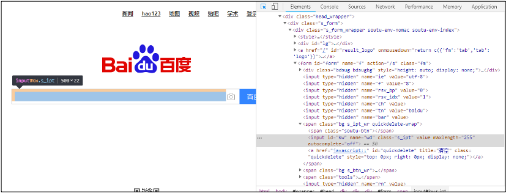</div>
<div align='center'>图7 利用浏览器查看百度首页的元素</div>
&#8195;&#8195;&#8194;(1)根据元素的id属性选择元素

&#8195;&#8195;&#8194;在图中，input元素，存在一个属性叫id，id类似于元素的编号，用来在html中标记该元素。根据规范，如果元素有id ，则此id是元素在当前页面的唯一标志。所以如果元素有id，根据id选择元素是最简单高效的方式。
&#8195;&#8195;&#8194;(2)根据name名称、class属性、tag名、xpath选择元素
&#8195;&#8195;&#8194;在没有元素id的情况下，我们可以根据元素的其他属性如：name、class、tag、xpath等。
&#8195;&#8195;&#8194;因此，在web自动化测试过程中，构建元素库维护页面元素，用于自动定位。
&#8195;&#8195;&#8194;元素库由多个UI（LogicalElementEntity）构成。每个UI拥有自己的名称（name）、关联对象（relateIdentifyObjectId）和元素列表（List<LogicalElementEntity>）。
&#8195;&#8195;&#8194;每个元素（LogicalElementEntity）包括元素详细信息（IdentifyAutoElementEntity）、关联对象（relateIdentifyObjectId）和关联元素列表（relateElementList）。
&#8195;&#8195;&#8194;每个元素的详细信息包括编号（id）、名称（name）、类型（classtype）、属性集（locatePropertyCollection）和对象库中关联的父对象编号（parentElementId）。
&#8195;&#8195;&#8194;属性集由主属性集（main_properties）、副属性集（addtional_properties）和辅助属性集（assistant_properties）构成。
&#8195;&#8195;&#8194;属性（LocateProperty）由名称（name）、值（value）和匹配方法（matchMethod）构成。
由上到下，元素-属性集-属性就是一个元素的基本架构。通过配置web系统中的元素，构成完整的元素库。

### 元素库配置方法
&#8195;&#8195;&#8194;在Web网站自动化测试系统中，每个被测系统下的功能点都会拥有一个自己的元素库。整个元素库的配置方法如下：
&#8195;&#8195;&#8194;(1)添加UI,输入UI名称和UI描述；
<div align='center'>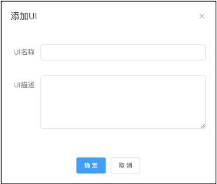</div>
<div align='center'>图8 利用浏览器查看百度首页的元素</div>
&#8195;&#8195;&#8194;(2)选择相应的UI，添加元素，为元素选择控件类型，将元素与自动化构件相关联，为元素选择主定位属性如id、name、text、xpath等，并写入对应的主定位属性值；
<div align='center'></div>
<div align='center'>图9 添加元素</div>
&#8195;&#8195;&#8194;(3)创建完成后可以点击创建好的元素，在右侧界面对其的名字、控件类型、定位属性等进行调整；
<div align='center'>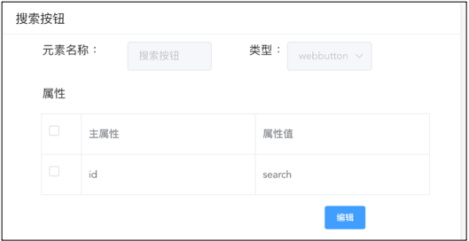</div>
<div align='center'>图10 调整元素信息</div>

## 执行代码管理
&#8195;&#8195;&#8194;在ATF自动化测试框架中，执行代码管理分为执行前代码管理和执行后代码管理。在测试框架中，对网站的测试操作是通过执行脚本程序的方式来进行的，同时在自动化测试的工作流程中，最重要的一步就是测试脚本代码执行的操作。如果我们观察一段脚本程序，并将其简单划分为几个部分的话，可以发现一个程序大致分为以下三部分：
&#8195;&#8195;&#8194;第一部分为程序的准备阶段，所做的工作大致为导入一些必要的类库，进行文件操作，执行时间的记录，初始化脚本等操作。
&#8195;&#8195;&#8194;第二部分是程序的核心部分，也是整个框架的工作的核心部分。中间部分的代码就是脚本中对网页进行操作，进行测试的一部分。这一部分的代码一般是由基础脚本这一模块自动生成的。
&#8195;&#8195;&#8194;第三部分是程序的末尾部分，主要功能是做一些脚本程序执行完毕后的一些收尾工作。
<div align='center'>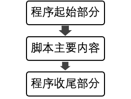</div>
<div align='center'>图11 一般程序的三段结构</div>
&#8195;&#8195;&#8194;由以上对一般程序的大致分析可以发现，脚本的中间部分由测试框架自动生成。因此，不同网页的测试脚本不同，而测试脚本之间的区别也就在于第二部分的测试脚本内容，而第一部分和第三部分在相同项目的一轮测试中内容一般是相同的。本着复用的思想，这些相同的代码如导入类库、设置执行环境执行条件等部分代码可以在每个测试项目的执行代码管理中由测试人员进行设置并在其中保存，并在不同的测试脚本中使用。第一部分的准备阶段代码对应执行前代码，第三部分的末尾部分代码则对应执行后代码。在实际执行过程中，框架将预先保存的、内容相同的公共代码与实际测试中需要的、自动生成的测试代码组装起来，组成一个完整的、可执行的脚本程序。

&#8195;&#8195;&#8194;ATF自动化测试框架支持多种脚本语言，在本节中，我们以Groovy脚本为例来解释执行代码管理的功能。Groovy运行在Java虚拟机（JVM）上，可以作为Java平台的脚本语言。ATF自动化测试框架目前运行在Java平台上，而Groovy由于其运行在Java虚拟机上的特性可以很好的与Java代码结合，也可以直接使用Java语言编写的库。
&#8195;&#8195;&#8194;下图为实际测试系统中该模块截图
<div align='center'>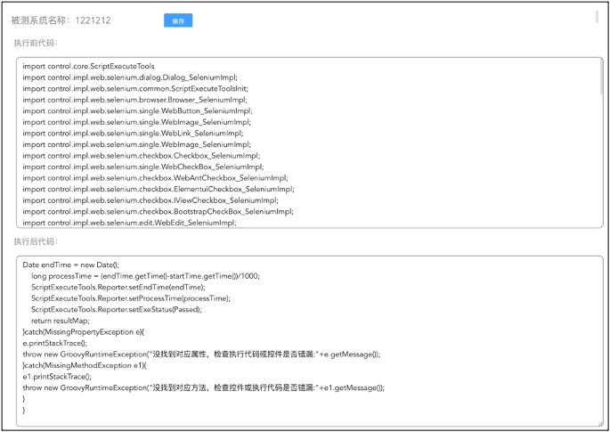</div>
<div align='center'>图12 执行代码管理模块</div>
&#8195;&#8195;&#8194;以下是一段实际测试使用中的执行前代码：

```
import control.core.ScriptExecuteTools;
import control.impl.web.selenium.Dialog_SeleniumImpl;
import control.impl.web.selenium.ScriptExecuteToolsInit;
import control.impl.web.selenium.WebButton_SeleniumImpl;
import control.impl.web.selenium.WebEdit_SeleniumImpl;
import org.openqa.selenium.WebDriver;
import java.util.Date;
import static constants.enumdefs.CaseRunFailCause.*;
import static constants.enumdefs.CaseRunStatus.*;
import run.batch.robot.*;

def helloWithoutParam(WebDriver driver,
File reporterFile,
File elementLibFile,
File objectLibFile){
    ScriptExecuteToolsInit.init(reporterFile, driver);
    ScriptExecuteTools.objectRepository.LoadFromFile(elementLibFile, objectLibFile);
    Date startTime = new Date();
ScriptExecuteTools.Reporter.SetStartTime(startTime);
```

&#8195;&#8195;&#8194;以下对部分语句进行介绍：

```
import org.openqa.selenium.WebDriver;
```
&#8195;&#8195;&#8194;这一语句作用是导入Selenium 2.0的WebDriver API。WebDriver API集成在Selenium 2.0中，提供了更简单简洁的API接口。它不依赖于任何特定的测试框架，因此它可以在单元测试项目中使用。
```
import java.util.Date;
Date startTime = new Date();
ScriptExecuteTools.Reporter.SetStartTime(startTime);
```
&#8195;&#8195;&#8194;这部分代码显然是对时间进行操作。ATF测试框架执行脚本之后可以自动生成执行记录单。执行记录单中时间信息是一个测试流程中非常重要的信息，在执行之前应在公共代码中对时间进行初始化。
```
def helloWithoutParam(WebDriver driver,
File reporterFile,
File elementLibFile,
File objectLibFile){
ScriptExecuteTools.objectRepository.LoadFromFile(elementLibFile, objectLibFile);
```
&#8195;&#8195;&#8194;这一部分代码定义了一个Groovy函数，参数是WebDriver类型的driver，文件类型的报告文件、元素库文件、对象库文件。之后将元素库、对象库在代码中导入。
&#8195;&#8195;&#8194;以下是一段实际测试使用中的执行后代码：
```
Date endTime = new Date();
    long processTime = (endTime.getTime()-startTime.getTime())/1000;
    ScriptExecuteTools.Reporter.SetEndTime(endTime);
    ScriptExecuteTools.Reporter.SetProcessTime(processTime);
    ScriptExecuteTools.Reporter.SetExeStatus(Passed);
}
```
&#8195;&#8195;&#8194;可以看到，这一部分代码在测试脚本部分执行完成后进行测试结束时间和测试持续时间的记录，并将记录单状态设置为测试通过。
&#8195;&#8195;&#8194;整个执行前代码与执行后代码将测试框架生成的脚本包裹在中间，形成了一个完整执行的程序。程序的功能由测试框架中的脚本配置所决定。这些公共代码进行了复用，避免了测试人员在测试过程中重复编写代码。当然，ATF自动化测试框架支持多种脚本语言，本节仅以Groovy语言作为示例，这一部分的代码可以根据实际需求进行内容或者语言类型的修改。

## 基础脚本
### 基础脚本的参数化原理
&#8195;&#8195;&#8194;ATF支持数据驱动脚本的功能，即测试数据不放在测试脚本中，而是由数据中心统一管理，实现测试脚本和测试数据分离，方便脚本的维护。数据驱动是通过参数化实现的，即测试脚本中的参数不是固定值，而是与数据中心的数据表格作关联，从数据表格中配置具体数据，这个与数据表格作关联的过程称为测试脚本的参数化。ATF支持批量自动参数化操作。
&#8195;&#8195;&#8194;脚本管理功能实现tcdl（用例描述语言）脚本语句的生成、解析、批量处理（参数化）、根据数据生成用例脚本、生成目标代码等功能，是ATF工具中脚本管理的核心。
&#8195;&#8195;&#8194;语句样例：
```
对象操作Ui(“uiname”).WebEdit(“eleName”).Set(datatable(“elemenname”));
```
&#8195;&#8195;&#8194;即需要支持连续函数调用，调用一个构造函数返回一个对象，再继续调用返回对象的函数。
&#8195;&#8195;&#8194;直接函数调用： ```funName(“abcd”);```
&#8195;&#8195;&#8194;工具类的静态函数调用：```Reporter.Log(“dfs”);```
&#8195;&#8195;&#8194;函数的参数可以为零个，可以为多个，多个参数以逗号分隔。每个参数为一个表达式。
&#8195;&#8195;&#8194;表达式支持以下类型及其组合：
&#8195;&#8195;&#8194;原子值：字符串常量（双引号包含），小数，整数，布尔值（true/false）；
&#8195;&#8195;&#8194;变量名：用于引用变量的值；
&#8195;&#8195;&#8194;工具类的属性（类似于java中类的静态编写）：格式如 类名.属性；
&#8195;&#8195;&#8194;四则运算：```+ - * /```；
&#8195;&#8195;&#8194;字符串拼接：```&```；
&#8195;&#8195;&#8194;函数调用：```1+add(2,4)```；
&#8195;&#8195;&#8194;改变优先级：```()```；
&#8195;&#8195;&#8194;逻辑运算符： ```and or```；
&#8195;&#8195;&#8194;序列：用```[]```包含，参见json格式或python数组的设计，代表数组或链表的数据结构；
&#8195;&#8195;&#8194;字典：格式为```{“key”: “value”, “key2”, “value2”}```。代表键值对集合。
&#8195;&#8195;&#8194;变量类型处理：变量为若类型，即不需要指定类型，编译器自行猜测变量类型
&#8195;&#8195;&#8194;获取数据相关函数，数据中心的数据分为几种，不同数据池中的数据生命周期和作用域不同：
&#8195;&#8195;&#8194;（1）数据表格中的数据```Data.TableColumn(“列名”)；```
&#8195;&#8195;&#8194;（2）流程用例数据池，流程用例的各节点可以共享，```Data.Flow(“数据名”)```
```Data.CaseNode(“节点名”, “数据名”)``` 指定流程节点中的流程数据；
&#8195;&#8195;&#8194;（3）场景中的配置数据```Data.Scene(“数据名”)```，只读，只能配置，运行时不可修改场景中的共享数据```Data.SceneGlobal(“数据名”)```，运行时可读写组合用例中的数据；
&#8195;&#8195;&#8194;（4）环境数据：```Data.Env(“数据名”)```,内置变量名，值不可修改，获取操作系统名称等；
&#8195;&#8195;&#8194;（5）数据生成器：随机数值，随机字母，当前日期；
&#8195;&#8195;&#8194;（6）内置函数列表：字符串处理，日期处理，流式函数调用。
&#8195;&#8195;&#8194;Tcdl的语言有两种，一种是调用元素库中的对象操作方法，一种是调用公共的工具方法。
&#8195;&#8195;&#8194;对应对象操作方法调用，支持自动参数化功能。操作方法的参数在“自动化控件管理”的抽象架构中进行了定义：某操作方法有哪些参数，哪些参数需要参数化，参数化后的列名是什么。
&#8195;&#8195;&#8194;自动参数化的处理步骤为：
&#8195;&#8195;&#8194;（1）先获取抽象架构中方法参数的配置；
&#8195;&#8195;&#8194;（2）如果某参数设置了要进行参数化，则将此参数值改为```Data.TableColumn(“列名”)```的形式，表示从数据中心的数据配置表格中的“列名”列获取值。列名由参数化配置指定，并且支持变量替换，替换变量的格式为```${变量名}```，内置的替换变量名有element：元素名称；
&#8195;&#8195;&#8194;（3）如果该参数未配置参数化，则保留原值。
&#8195;&#8195;&#8194;例如：```ui(“主页”).WebEdit(“登录名”).Set(“dsf”)```，
&#8195;&#8195;&#8194;表示ui（主页）的WebEdit控件（登录名）采用Set方法且写死填入值"dsf"

### 目标代码的生成
&#8195;&#8195;&#8194;目标代码生成之前需要先生成用例脚本。
&#8195;&#8195;&#8194;用例脚本生成过程：
&#8195;&#8195;&#8194;先分析模板脚本中的代码，然后依次处理各语句，语句类型为对象方法调用。
&#8195;&#8195;&#8194;获取方法的参数：
&#8195;&#8195;&#8194;（1）方法无参数的情况，如果未设置```@display```，则直接输出原语句；如果设置了```@display```，则根据```DataTable```中的值进行判断：```DataTable```中值不为空，则输出原语句，为空则不输出。
&#8195;&#8195;&#8194;（2）方法有参数时，依次分析各参数表达式：
&#8195;&#8195;&#8194;参数表达式中依次分析各原子值，原子值类型为
&#8195;&#8195;&#8194;1）	常量值，直接输出；
&#8195;&#8195;&#8194;2）	固定值获取：流程变量，场景变量，内部变量时，直接输出；
&#8195;&#8195;&#8194;3）	参数化数据表格中的值：```Data.Table(“列名”)```，则从数据表格中获取参数值，获取后根据不同情况进行处理；
&#8195;&#8195;&#8194;参数值的处理：
&#8195;&#8195;&#8194;留空：则不输出此语句，但是要输出步骤编排中的步骤；
&#8195;&#8195;&#8194;空值（nil）：参数值取空字符串```“”```；
&#8195;&#8195;&#8194;Null，程序中的```null```值；
&#8195;&#8195;&#8194;```{expr=}```表达式，检查是否符合规范，符合的直接输出，不符的报错；
&#8195;&#8195;&#8194;常量值：默认为常量字符串；
&#8195;&#8195;&#8194;编排步骤的处理：
&#8195;&#8195;&#8194;以---分隔的表示在步骤前插入还是在步骤后插入，可以编写任意的tcdl语句，但是表达式中的参数不能再写参数化到数据表格。
&#8195;&#8195;&#8194;目标语言生成具体执行时才即时生成。
&#8195;&#8195;&#8194;对象方法调用：
&#8195;&#8195;&#8194;固定值不可修改，实际上是取固定配置。可配置时生成配置的，参数处理，运算符直接输出，函数类型：数据池除了运行时变量（流程数据，用例内变量）其他的为可确定的值，换成具体值。数据类型支持序列和字典目标代码参数替换：。替换参数形式为：```${{参数名}}```，则替换成传入的参数值。
&#8195;&#8195;&#8194;参数值为常量值的，直接替换，字符串加```“”```，数值直接输出，序列和字典根据不同语言替换成对应语言的。
&#8195;&#8195;&#8194;参数值为表达式的，将表达式中确定的量改为固定值，不固定的量（目前只有用例内部产生的变量）改为语言对应的，注意数据类型识别。

## 执行机管理
&#8195;&#8195;&#8194;进入ATF首页，点击“系统管理”，点击“执行机管理”，便可在页面上查看目前所有正在启用中的执行机信息。
<div align='center'>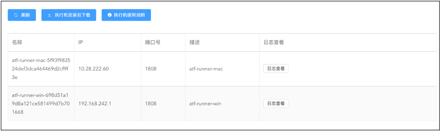</div>
<div align='center'>图13 执行机管理页面</div>
&#8195;&#8195;&#8194; 在执行机管理页面中选中一台执行机，点击“日志查看”，便可实时查看执行机运行时的日志。
<div align='center'>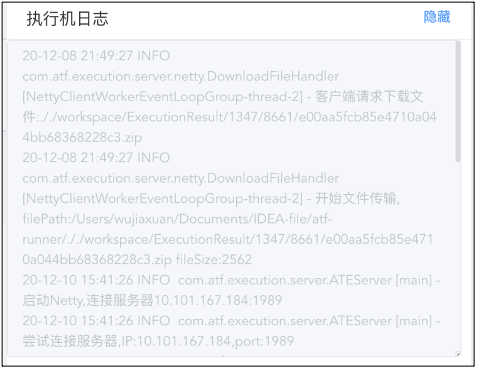</div>
<div align='center'>图14 执行机日志查看</div>
&#8195;&#8195;&#8194; 在执行机管理页面中，点击“执行机安装包下载”即可下载zip格式的执行机压缩包，将压缩包解压以后，按照文件夹内执行机说明的指示即可使用执行机。
<div align='center'>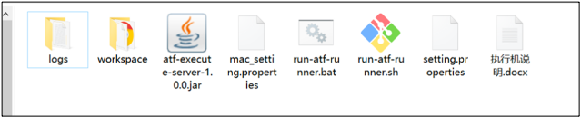</div>
<div align='center'>图15 执行机安装包内文件</div>

## 用户权限
&#8195;&#8195;&#8194;ATF权限设计采用基于角色的访问控制，针对不同的角色访问资源进行权限控制，避免因权限控制确实或操作不当引发风险问题。系统在原有基础上加一个系统管理的分页，分页中包含企业管理、角色管理、菜单管理以及用户管理页面，如图16所示。
<div align='center'>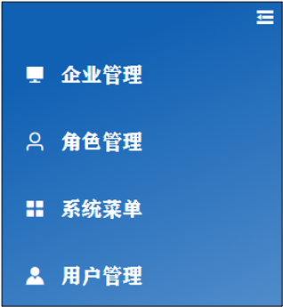</div>
<div align='center'>图16 系统管理菜单</div>

&#8195;&#8195;&#8194;其中企业管理管理着ATF系统中所有的注册企业，在此页面可以新增企业、编辑企业、查看企业详情等；角色管理管理着ATF系统中所设定的角色，以及各个角色相应的权限授予；菜单管理展示ATF系统中的所有的菜单及其相应的权限路由，供用户查看系统中的页面权限列表；用户管理管理着系统中所有的用户。
&#8195;&#8195;&#8194;系统角色划分主要分为超级系统管理员、系统管理员、项目经理、功能测试人员、技术支持人员。各个角色之间的关系见图17。
<div align='center'>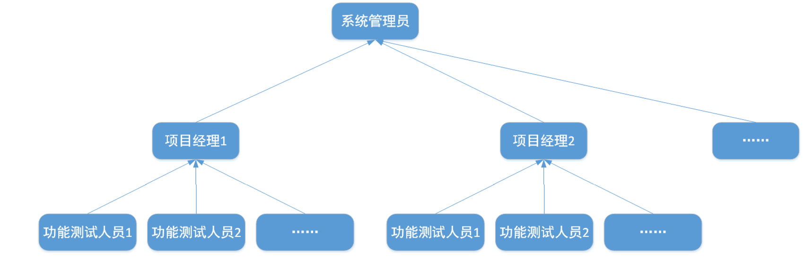</div>
<div align='center'>图17 角色之间关系图</div>
&#8195;&#8195;&#8194;其中，超级管理员是系统固定的一个角色，有超级权限，拥有着权限管理的操作，他拥有着不同企业管理员的查看和添加的审批权限，并管理角色和菜单的增删改查的权限，并为不同企业提供固定的自动化构件库。

&#8195;&#8195;&#8194;系统管理员是面向企业的一个角色，除了基础的系统页面的增删改查基础上，还拥有着权限管理的操作，他拥有所在企业系统用户的查看权限，并控制着项目经理角色的审批权限，可为不同角色赋予相应的菜单权限，同时也拥有着全部项目的增删改查的权限。
&#8195;&#8195;&#8194;项目经理管理着一个项目组，其角色对应用户的添加/修改要经过系统管理员的审批，其管理着一个项目组，该角色拥有自己项目组中用户的查看权限，以及用户的添加和修改的审批工作，但本身没有增加删除修改组中用户信息的权限，同时他也拥有自己所在项目组的所有项目的数据的增删改查的权限。
&#8195;&#8195;&#8194;功能测试人员在一个项目组中，只拥有本身信息的添加、查看和修改权限，其添加要经过所在项目中的项目经理的审批，该角色拥有自己所在项目组中的所有项目的数据的查看权限，但只拥有自己所负责项目的添加、修改和删除的权限。
&#8195;&#8195;&#8194;技术支持人员是面向系统底层的技术人员，其角色对应用户的添加和修改要经过系统管理员的审批，其只拥有自动化构件页面的增删改查的管理权限。
